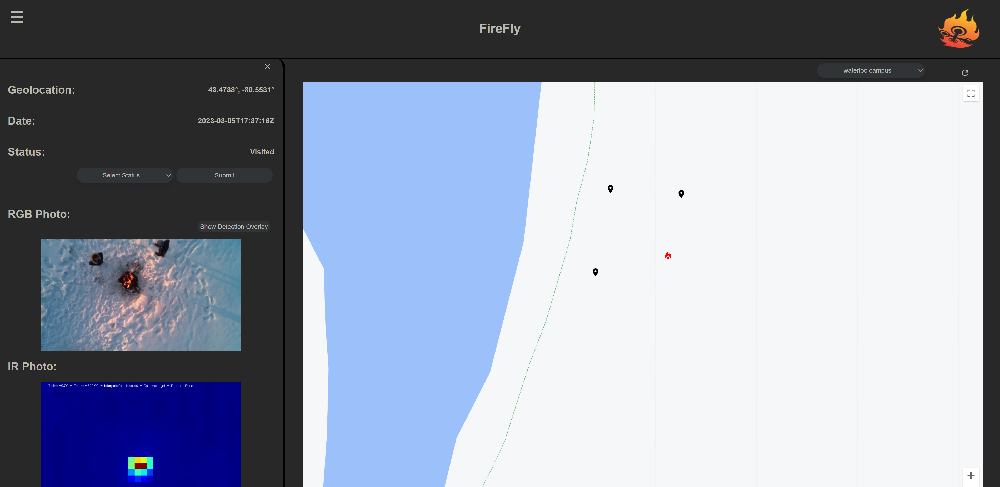
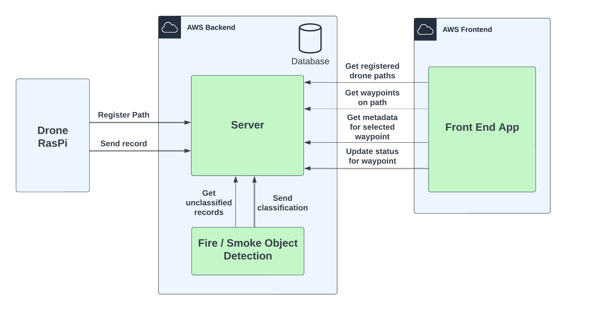
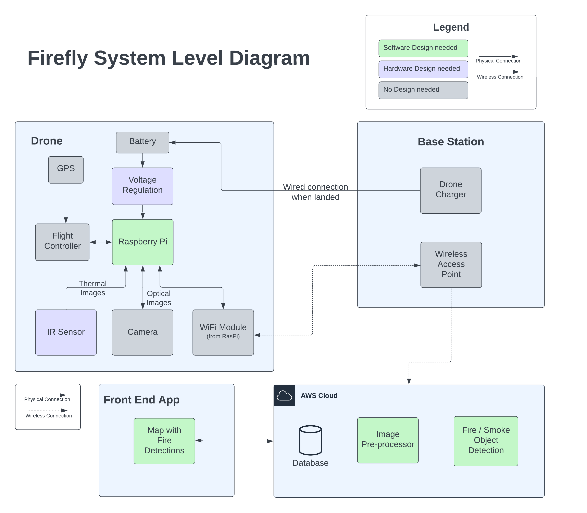
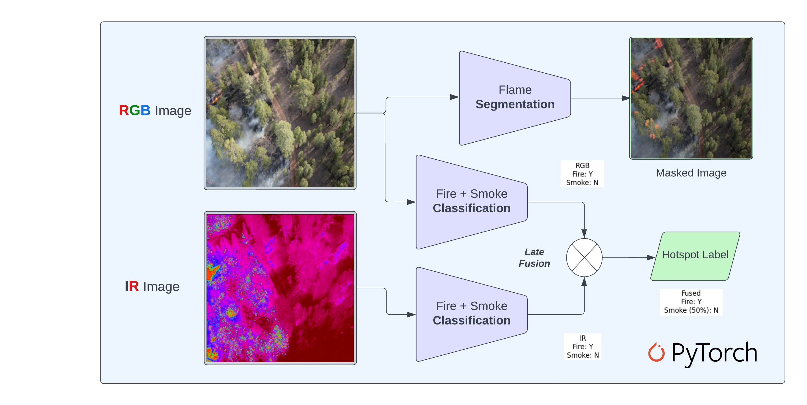
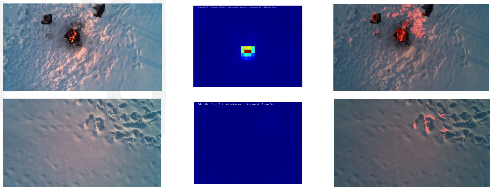
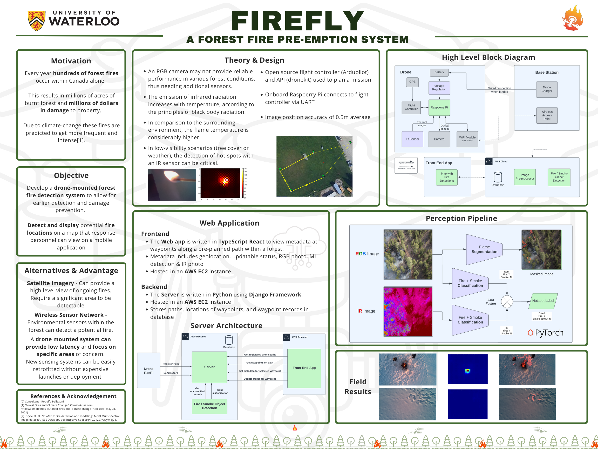
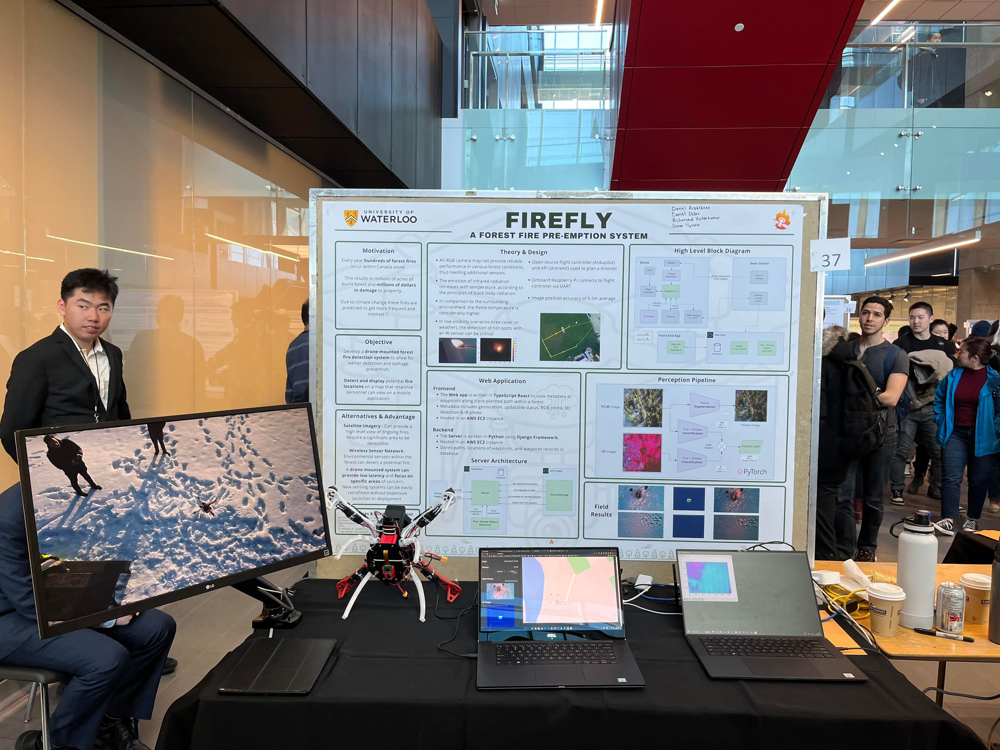

# Firefly

## A forest fire pre-emption system

### Description

### Motivation
- Every year hundreds of forest fires occur within Canada alone. 
- This results in millions of acres of burnt forest and millions of dollars in damage to property. 
- Due to climate-change these fires are predicted to get more frequent and intense[1].

### Objective
- Develop a drone-mounted forest fire detection system to allow for earlier detection and damage prevention. 
- Detect and display potential fire locations on a map that response personnel can view on a mobile application

### Alternatives & Advantages
- Satellite Imagery - Can provide a high level view of ongoing fires. Require a significant area to be detectable
- Wireless Sensor Network - Environmental sensors within the forest can detect a potential fire.
- A drone mounted system can provide low latency and focus on specific areas of concern.
- New sensing systems can be easily retrofitted without expensive launches or deployment 

### Theory & Design
- An RGB camera may not provide reliable performance in various forest conditions, thus needing additional sensors.
- The emission of infrared radiation increases with temperature, according to the principles of black body radiation.
- In comparison to the surrounding environment, the flame temperature is considerably higher.
- In low-visibility scenarios (tree cover or weather), the detection of hot-spots with an IR sensor can be critical.
- Open source flight controller (Ardupilot) and API (dronekit) used to plan a mission
- Onboard Raspberry Pi connects to flight controller via UART
- Image position accuracy of 0.5m average

### Web Application

#### Front End

Application Url: 
http://firefly808.com/

#### Back End

### Block Diagram

### Perception Pipeline

### Results

### Poster

### Symposium

### Team

Readme with images:
https://github.com/FireFly-808/.github/tree/master/profile

